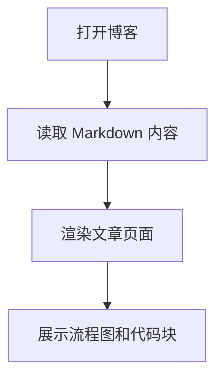
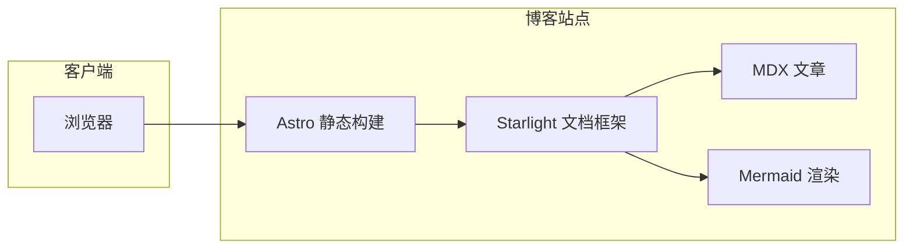
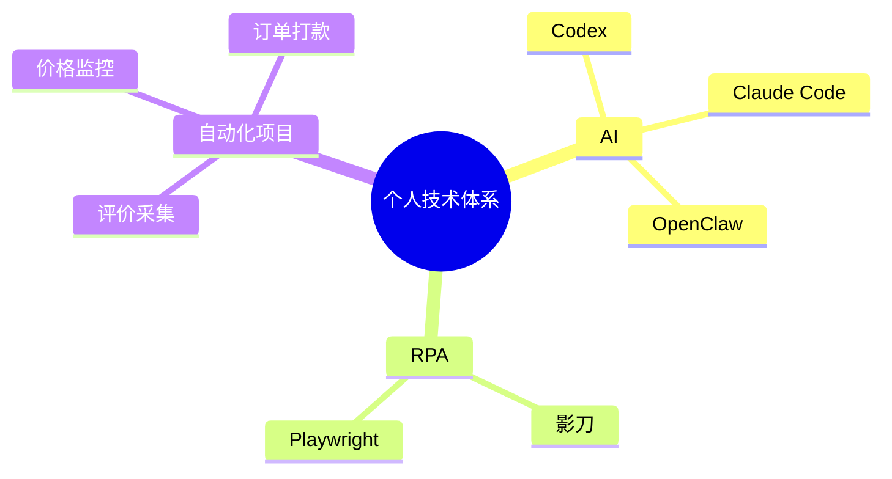
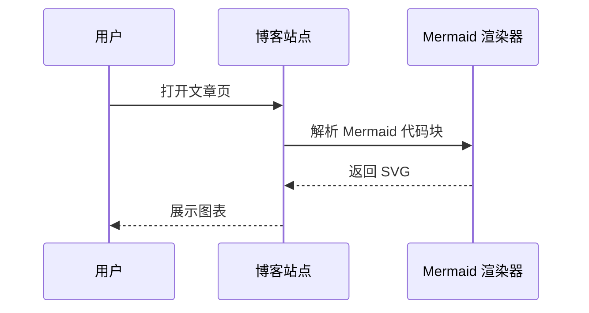

# 个人博客网站 PRD

> 状态：技术栈与图表方案已定
> 日期：2026-06-27  
> 项目阶段：本地开发准备阶段  
> 技术栈（已确定）：Astro + Starlight + MDX
> 图表方案（已确定）：Mermaid

---

## 1. 项目背景

当前计划建设一个个人博客网站，主要用于沉淀个人技术经验、AI 工具实践、RPA 自动化项目记录、Codex / OpenClaw 使用经验、影刀相关知识与项目复盘。

前期不希望花钱购买服务器，因此先在本地开发与运行，后续再根据实际使用情况决定是否迁移到云服务器、Cloudflare Pages、GitHub Pages 或其他静态托管平台。

---

## 2. 项目定位

本项目不定位为传统日记型博客，而是更偏向：

```text
个人技术知识库 + 项目展示 + 图表化文档站
```

核心内容方向包括：

- AI / Agent / Codex / OpenClaw 使用记录
- RPA / 影刀 / Playwright 自动化经验
- 自动化项目 PRD、方案、流程说明
- 代码片段、错误排查、工具使用教程
- 项目架构图、流程图、框架图、思维导图
- 个人技术栈与项目展示

---

## 3. 当前目标

### 3.1 第一阶段目标

第一阶段只追求本地可用、结构清晰、方便后续迁移。

目标：

- 在本地创建博客项目目录。
- 明确网站定位、能力范围、技术方案与图表方案。
- 后续可用 Codex 辅助初始化项目。
- 优先支持 Markdown / MDX 写作。
- 优先支持流程图、架构图、框架图、思维导图。
- 保持项目简单，不提前引入数据库、后台、登录等复杂能力。

### 3.2 非目标

以下内容当前不做：

- 不做评论功能。
- 不做后台管理。
- 不做登录系统。
- 不做数据库。
- 不做 CMS。
- 不做用户系统。
- 不做在线画图编辑器。
- 不做复杂动画和重型前端交互。

---

## 4. 明确约束

### 4.1 评论功能约束

评论功能现在不做，未来也不做。

原因：

- 个人博客以内容沉淀为主，不需要互动社区能力。
- 评论系统会引入审核、垃圾评论、安全、第三方服务依赖等维护成本。
- 会让静态博客复杂化。

结论：

```text
评论功能：永久排除。
```

### 4.2 后台与登录约束

后台、登录前期不做。

原因：

- 写作内容可以直接通过 Markdown / MDX 文件管理。
- Git 本身可以承担版本管理和内容备份。
- 登录和后台会引入权限、安全、接口、数据库等复杂度。
- 当前目标是个人技术知识库，不是内容管理平台。

结论：

```text
后台：前期不做。
登录：前期不做。
```

---

## 5. 本地开发环境建议

### 5.1 项目位置

建议博客项目源码放在 WSL Linux 文件系统中，例如：

```bash
~/projects/personal-blog
```

不建议长期放在：

```bash
/mnt/c/Users/Administrator/Desktop/personal-blog
```

原因：

- WSL 内部文件系统对 Node / 前端项目性能更好。
- 更接近未来 Linux 云服务器环境。
- 以后迁移到服务器或静态托管平台更顺。

当前项目目录已经位于 WSL 内部文件系统，可直接作为正式源码目录使用。

### 5.2 推荐开发方式

```text
WSL 保存源码
↓
VS Code Remote WSL 打开项目
↓
Codex 在 WSL 项目目录辅助开发
↓
Windows 浏览器访问 localhost 预览
```

开发环境约束：

- Codex / Claude Code / OpenClaw 执行项目命令时，应在 WSL 项目目录中运行。
- 安装依赖、启动开发服务、运行构建和测试时，不使用 Windows PowerShell、CMD 或 Windows 路径。
- Windows 仅用于浏览器访问 `localhost` 预览。
- 不要把项目复制到 `/mnt/c`、桌面或其他 Windows 目录中开发。

---

## 6. 网站风格方向

候选风格：

```text
现代 SaaS 文档站 + 个人技术博客
```

视觉关键词：

- 现代化
- 干净
- 大留白
- 细边框卡片
- 轻量玻璃拟态
- 深浅色切换
- 代码块美化
- 图表卡片化
- 项目卡片展示
- 首页有个人技术品牌感

避免风格：

- 传统 WordPress 博客感
- 赛博朋克过重
- 花哨个人主页
- 大量动画
- 游戏 UI 风格
- 复杂后台系统风格

---

## 7. 技术栈

> 状态：已确定采用 Astro + Starlight，其他方案留作记录与备查。

### 7.1 已确定采用：Astro + Starlight + MDX

采用组合：

```text
Astro + Starlight + MDX
```

确定原因：

- 适合内容型网站。
- 适合博客、文档、项目展示混合形态。
- 静态构建友好。
- 以后可部署到 Cloudflare Pages、GitHub Pages、Vercel 或云服务器。
- Starlight 自带文档站常用能力，例如导航、搜索、暗色模式、代码高亮等。
- 可以在 Markdown 中嵌入 MDX 组件，扩展能力强。

适合本项目的点：

- 可以把博客做成技术知识库。
- 可以支持多层级文档结构。
- 可以写 Markdown / MDX。
- 适合后续 Codex 逐步开发。

Markdown / MDX 使用边界：

- 普通文章优先使用 `.md`。
- 需要引入 Astro 组件、项目卡片、特殊 Callout、交互式展示时，再使用 `.mdx`。
- 避免所有文章默认使用 `.mdx`，减少复杂度。

### 7.2 不采用：Docusaurus

适合场景：

- 更偏开源项目文档站。
- 文档结构稳定。
- 项目文档多于个人博客内容。

不采用的原因：

- 视觉风格容易偏传统技术文档。
- 自定义个人主页和现代化视觉时，可能不如 Astro 灵活。
- 当前项目最终选择了 Astro + Starlight。

### 7.3 不采用：VitePress

适合场景：

- 简洁技术文档。
- Vue 生态。
- 轻量知识库。

不采用的原因：

- 更偏文档站，不太像个人技术博客。
- 图表能力通常需要额外配置。
- 当前项目最终选择了 Astro + Starlight。

### 7.4 不采用：Next.js / Nextra / Fumadocs

优点：

- 视觉效果可以很高级。
- 生态丰富。
- 适合产品化文档站。

不采用的原因：

- Next.js 生态相对更重。
- 当前不需要后台、登录、数据库、动态能力。
- 容易把第一版做复杂。
- 当前项目最终选择了 Astro + Starlight。

---

## 8. 图表与框架图能力

> 状态：已确定使用 Mermaid 覆盖所有图表与框架图需求，其他方案留作记录与备查。

### 8.1 已确定采用：Mermaid

用途：

- 流程图
- 时序图
- 状态图
- 类图
- ER 图
- 甘特图
- Git 分支图
- 架构图 / 框架图（flowchart + subgraph / block-beta）
- 数据流图
- 思维导图（mermaid mindmap 语法）

确定原因：

- 一套语法覆盖流程、时序、状态、类图、ER、甘特、Git、架构、思维导图等大部分场景。
- 配合 MDX 可直接在 Markdown 中渲染，不需要外部图床。
- 暗色模式兼容良好。
- 维护成本低，不需要再额外接入 D2、Markmap、PlantUML 等多套方案。

使用边界：

- Mermaid 作为第一版唯一代码图表方案，但不强求所有图都用 Mermaid。
- 复杂手绘草图、产品草图、非结构化图仍允许使用 Excalidraw 导出 SVG / PNG 嵌入。
- 如果 Mermaid 表达成本明显过高，优先简化图表，而不是引入新图表方案。

适合文章：

- 影刀流程说明
- RPA 自动化流程
- API 调用流程
- 异常处理流程
- 订单打款流程
- 评价采集流程
- OpenClaw 多 Agent 架构
- RPA + AI 表格架构
- 评价采集器整体架构
- 本地博客部署结构
- 价格监控系统结构
- AI 工具体系
- RPA 自动化知识树
- Codex / Claude Code / OpenClaw 对比
- 个人技能地图

示例（流程图）：



示例（架构图）：



示例（思维导图）：



示例（时序图）：



### 8.2 暂不引入：D2

> 状态：已确定由 Mermaid 统一覆盖架构图与数据流图，D2 暂不引入。

适用场景（仅作记录）：

- 系统架构图
- 框架图
- 模块关系图
- 数据流图
- Agent 协作图

暂不引入的原因：

- Mermaid 已能覆盖上述大部分场景。
- 多套图表方案会增加接入、维护、样式同步成本。
- 第一版追求简单，不引入第二套图表 DSL。

如未来出现 Mermaid 难以表达的需求，再单独评估是否引入 D2。

### 8.3 暂不引入：Markmap

> 状态：已确定由 Mermaid 的 mindmap 语法覆盖思维导图，Markmap 暂不引入。

适用场景（仅作记录）：

- 思维导图
- 知识树
- 技能树
- 工具分类图

暂不引入的原因：

- Mermaid 已提供 mindmap 语法，可直接覆盖上述场景。
- 不再单独接入 Markmap 以减少前端依赖。

### 8.4 Excalidraw SVG / PNG

> 状态：保留为图片资产嵌入方式，与 Mermaid 是互补定位。

使用方式：

```text
Excalidraw 画图
↓
导出 SVG / PNG
↓
放入博客文章
```

适合：

- 手绘风架构图
- 灵感草图
- 产品方案草图
- 非严格技术图

暂不做：

- 不在博客内集成 Excalidraw 在线编辑器。

原因：

- 会增加前端复杂度。
- 当前只需要展示图，不需要在线编辑。
- Mermaid 负责代码渲染的图表，Excalidraw 负责手绘风格的图片资产，两者互补而非替代。

### 8.5 暂不引入：PlantUML

> 状态：第一版不接入。

适用场景（仅作记录）：

- UML 类图
- 组件图
- 部署图
- 用例图
- 正式时序图

暂不引入的原因：

- Mermaid 已能覆盖类图、时序图等场景。
- PlantUML 更偏正式软件工程图，第一版不是刚需。

---

## 9. 第一版能力范围

### 9.1 建议纳入第一版的能力

- 中文站点标题和基础信息。
- 首页个人介绍。
- 项目展示页。
- 技术文章 / 文档页。
- 文章目录。
- 标签或分类。
- 全站搜索。
- 暗色模式。
- 代码高亮。
- Mermaid 图表（流程 / 时序 / 状态 / 类图 / ER / 甘特 / Git / 架构 / 思维导图）。
- Excalidraw SVG / PNG 嵌入说明。

### 9.2 明确不纳入第一版的能力

- 评论功能。
- 登录系统。
- 后台管理。
- 数据库。
- CMS。
- 用户系统。
- 在线画图编辑器。
- 支付功能。
- 复杂动画。
- 多语言。
- D2 图表方案。
- Markmap 思维导图。
- PlantUML。

---

## 10. 目录结构

> 状态：基于已确定的 Astro + Starlight 设计，Mermaid 作为唯一图表方案。

```text
personal-blog/
├── README.md
├── PRD-个人博客网站.md
├── package.json
├── astro.config.mjs
├── src/
│   ├── pages/
│   │   ├── index.astro          # 首页
│   │   ├── projects.astro       # 项目展示页
│   │   └── about.astro          # 关于页，可选
│   ├── content/
│   │   └── docs/
│   │       ├── index.mdx
│   │       ├── ai/
│   │       │   ├── codex.md
│   │       │   └── agent.md
│   │       ├── rpa/
│   │       │   ├── shadowbot.md
│   │       │   └── playwright.md
│   │       ├── diagrams/
│   │       │   └── mermaid.md
│   │       └── projects/
│   │           ├── review-collector.md
│   │           └── price-monitor.md
│   ├── components/
│   │   ├── Hero.astro
│   │   ├── ProjectCard.astro
│   │   └── DiagramCard.astro
│   └── styles/
│       └── custom.css
└── public/
    └── images/
```

当前不立即创建完整结构，等初始化框架时再由 Codex 生成。

目录分工说明：

- `src/pages`：自定义页面，例如首页、项目展示页、关于页。
- `src/content/docs`：Starlight 文档内容和技术文章。
- `src/components`：首页、项目卡片、图表卡片等复用组件。
- `src/styles`：自定义样式。
- `public/images`：图片、截图、Excalidraw 导出图等静态资产。

---

## 11. Codex 开发策略

### 11.1 总体原则

Codex 适合辅助实现该项目，但不应该一次性给它过大的任务。

开发原则：

- 一次只做一个目标。
- 先跑通，再美化。
- 先静态页面，再增强图表能力。
- 不主动引入数据库。
- 不主动引入后台。
- 不主动引入登录。
- 不主动引入评论系统。
- 新增依赖必须说明原因。
- 每次改动后运行构建验证。

### 11.2 建议开发阶段

#### 阶段 1：项目初始化

目标：

```text
能在 WSL 本地启动博客。
```

候选任务：

- 初始化 Astro + Starlight 项目。
- 设置中文站点标题。
- 配置基础导航。
- 添加首页、博客页、项目页。
- 确保本地开发命令正常运行。

验证：

```bash
npm run dev
```

#### 阶段 2：图表能力

目标：

```text
Markdown / MDX 中能展示 Mermaid 流程图、时序图、架构图、思维导图。
```

候选任务：

- 接入 Mermaid（含 flowchart、sequenceDiagram、mindmap 等语法）。
- 新增 diagrams 示例文章。
- 每种图表给一个最小示例。

验证：

- 打开示例文章。
- 确认图表能渲染。
- 确认暗色模式下可读。

#### 阶段 3：视觉美化

目标：

```text
看起来像现代个人技术博客。
```

候选任务：

- 优化首页 Hero 区。
- 增加项目卡片。
- 优化文章宽度。
- 优化代码块样式。
- 优化图表容器。
- 增加浅色 / 暗色兼容样式。

验证：

- 首页不丑。
- 文章页清晰。
- 图表页清晰。
- 移动端宽度不炸。

#### 阶段 4：内容结构

目标：

```text
后续文章容易管理。
```

候选任务：

- 建立 AI、RPA、Projects、Diagrams 分类。
- 写入示例文章。
- 增加文章模板。
- 明确图片路径规范。

### 11.3 第一版完成标准

第一版完成需要满足：

- WSL 内部项目可正常运行 `npm run dev`。
- `npm run build` 可通过。
- 首页可访问。
- 至少包含 AI、RPA、Projects、Diagrams 四类内容入口。
- 至少有 3 篇示例文章。
- Mermaid 示例页能展示流程图、时序图、架构图、思维导图。
- 暗色模式下文章、代码块、图表可读。
- 不包含评论、登录、后台、数据库、CMS。

---

## 12. 开发辅助 Skill 推荐清单

> 重要说明：以下 Skill 指 **Codex / OpenClaw / Agent 在开发本博客项目时可调用的辅助能力**，不是博客网站面向用户提供的功能。  
> 以下均为候选考虑，不代表最终采纳。

### 12.0 Skill 安装与启用策略

本项目可以先准备 / 安装全部候选 Skill，但实际开发时不要求每次全部启用。

原则：

- Skill 可以全部安装，方便后续按需调用。
- 每次开发任务只启用与当前目标直接相关的 Skill。
- 小任务少用 Skill，避免上下文过重。
- 大任务、跨文件任务、图表任务、视觉优化任务、部署任务再启用对应 Skill。
- `minimal-change-review-skill` 可作为通用审查 Skill，在 Codex 完成较大改动后调用。

阶段使用建议：

| 阶段 | 目标 | 建议启用 Skill |
|---|---|---|
| 阶段 1：项目初始化 | 跑通 Astro + Starlight 本地项目 | `astro-starlight-project-skill`、`minimal-change-review-skill` |
| 阶段 2：基础内容 | 写首页、项目页、示例文章 | `markdown-mdx-authoring-skill`、`minimal-change-review-skill` |
| 阶段 3：图表能力 | 接入 / 编写 Mermaid 示例，覆盖流程图、时序图、架构图、思维导图 | `diagram-authoring-skill`、`dependency-research-skill`、`minimal-change-review-skill` |
| 阶段 4：视觉美化 | 优化首页、卡片、文章阅读体验 | `ui-polish-skill`、`minimal-change-review-skill` |
| 阶段 5：部署预研 | 本地构建、静态托管、服务器部署 | `deployment-skill`、`minimal-change-review-skill` |
| 阶段 6：内容迁移 | 把 Obsidian、PRD、项目记录迁移为博客文章 | `content-migration-skill`、`markdown-mdx-authoring-skill` |

任务触发建议：

| 任务类型 | 优先 Skill |
|---|---|
| 改 Astro / Starlight 配置 | `astro-starlight-project-skill` |
| 写文章 / 改文章结构 | `markdown-mdx-authoring-skill` |
| 写流程图 / 架构图 / 思维导图 | `diagram-authoring-skill` |
| 查插件 / 新增依赖 | `dependency-research-skill` |
| 改 UI / CSS / 组件样式 | `ui-polish-skill` |
| 审查 Codex 改动 | `minimal-change-review-skill` |
| 构建 / 部署 / 迁移服务器 | `deployment-skill` |
| 整理旧笔记成博客 | `content-migration-skill` |

---

### 12.1 astro-starlight-project-skill

用途：协助初始化和维护 Astro + Starlight 项目结构。

适合在这些任务中调用：

- 初始化 Astro + Starlight 项目。
- 配置 `astro.config.mjs`。
- 调整 Starlight 侧边栏、导航、站点标题。
- 规划 `src/pages`、`src/content/docs`、`src/components`、`src/styles` 目录。
- 排查 Astro / Starlight 构建错误。

候选约束：

- 第一版优先保持静态站点。
- 不主动引入数据库、后台、登录、评论系统。
- 不把文档站改成重型前端应用。
- 新增依赖必须说明用途。
- 修改后优先运行 `npm run build` 验证。

### 12.2 markdown-mdx-authoring-skill

用途：协助编写、整理 Markdown / MDX 技术文章。

适合在这些任务中调用：

- 把项目经验整理成博客文章。
- 把 PRD、方案、排错过程改写成技术文章。
- 生成文章 frontmatter，例如 `title`、`description`、`date`、`tags`。
- 判断普通 `.md` 够不够，还是需要 `.mdx`。
- 规范文章标题层级、代码块、说明段落。

候选约束：

- 普通文章优先用 `.md`。
- 需要组件、卡片、特殊展示时再用 `.mdx`。
- 文章内容优先清晰，不追求花哨排版。
- 图表必须配文字说明。

### 12.3 diagram-authoring-skill

用途：协助生成 Mermaid 图表内容。

适合在这些任务中调用：

- 业务流程图、自动化流程图、时序图、状态图、类图、ER 图、甘特图、Git 分支图。
- 系统架构图、模块关系图、数据流图（用 flowchart + subgraph / block-beta 表达）。
- 知识树、工具分类、学习路线（用 mermaid mindmap 语法表达）。
- 判断一篇文章里应该使用哪种图表。

候选约束：

- 第一版只使用 Mermaid，不引入 D2、Markmap、PlantUML。
- Mermaid 直接在文章中渲染，不依赖外部图床。
- 单张图不要塞太多节点。
- 图表必须配文字说明。

### 12.4 ui-polish-skill

用途：协助做现代化视觉优化，约束 Codex 不要乱改结构。

适合在这些任务中调用：

- 优化首页 Hero 区。
- 优化项目卡片。
- 优化文章页阅读体验。
- 优化代码块、图表容器、Callout 样式。
- 调整浅色 / 暗色模式兼容样式。

候选约束：

- 只改样式和必要组件布局。
- 不改内容组织逻辑。
- 不引入大型 UI 框架，除非明确要求。
- 保持现代 SaaS 文档站风格。
- 避免重动画和复杂交互。

### 12.5 minimal-change-review-skill

用途：在 Codex 修改后做审查，避免过度工程化和无关改动。

适合在这些任务中调用：

- Codex 完成初始化后审查目录是否合理。
- 新增依赖后审查是否必要。
- 修改多个文件后审查是否超出需求。
- 构建失败后审查修复是否最小。

候选审查点：

- 是否只实现了当前目标。
- 是否引入了不必要的数据库、后台、登录、CMS、评论能力。
- 是否重构了无关文件。
- 是否新增了低价值封装。
- 是否运行了 `npm run build` 或对应验证命令。

### 12.6 dependency-research-skill

用途：在新增依赖前，协助调研 Astro / Starlight 生态中的合适方案。

适合在这些任务中调用：

- 查 Mermaid 在 Astro / Starlight 中的推荐接入方式。
- 查 Mermaid 主题、暗色模式、Codex 自动渲染等插件方案。
- 对比插件是否维护活跃、是否复杂、是否必要。
- 评估是否需要再为图表 / 思维导图引入额外依赖。

候选约束：

- 优先官方文档、活跃插件、简单方案。
- 没有明显收益时不新增依赖。
- 第一版能用 Mermaid 自带语法解决的，不引入第二套图表方案。

### 12.7 deployment-skill

用途：后续协助本地运行、构建和部署方案选择。

适合在这些任务中调用：

- 配置本地 `npm run dev`。
- 配置 `npm run build`。
- 评估 GitHub Pages、Cloudflare Pages、Vercel、Nginx 本地部署。
- 后续从本地迁移到云服务器或静态托管平台。

候选约束：

- 前期优先本地开发和预览。
- 不提前购买服务器。
- 不提前引入复杂 CI/CD。
- 部署前必须确认构建产物 `dist/` 正常。

### 12.8 content-migration-skill

用途：后续协助把现有笔记、PRD、项目说明迁移成博客文章。

适合在这些任务中调用：

- 把 Obsidian 笔记整理成博客文章。
- 把项目 PRD 拆成项目页和技术文章。
- 把排错记录整理成“问题-原因-解决方案”格式。
- 统一图片路径和附件引用。

候选约束：

- 不改变原始事实。
- 保留必要上下文。
- 优先短标题、清晰结构、可搜索关键词。
- 文章中涉及未最终采纳的方案，需要明确标注为候选或历史记录。

---

## 13. 后续决策点

以下内容后续再决定：

- 是否使用 MDX 组件（Callout、ProjectCard、DiagramCard 等）。
- 是否创建真实 Codex / OpenClaw Skill 文件。
  - 当前先在 PRD 中定义全部候选 Skill 的用途和触发阶段。
  - 实际是否创建真实 Skill 文件，待初始化项目后再执行。
  - 如创建，则可以全部创建，但开发时按阶段启用，不要求每次全部加载。
- 是否部署到 Cloudflare Pages / GitHub Pages。
- 是否购买域名。
- 是否未来上云。
- 是否为 Mermaid 增加自定义主题。

---

## 14. 最终结论

> 状态：已锁定（2026-06-27 起）。本节为技术栈、图表方案、明确排除项与最重要边界的最终结论，后续不再回退；如需调整必须新增决策记录。

已确定方向：

```text
WSL + Astro + Starlight + MDX + Mermaid
```

明确排除：

```text
D2：暂不引入。
Markmap：暂不引入。
PlantUML：暂不引入。
Excalidraw：仅作为导出图片资产嵌入，不做在线编辑器。
```

最重要的边界：

```text
评论功能：现在、未来都不做。
后台：前期不做。
登录：前期不做。
数据库：前期不做。
```

开发策略：

```text
PRD 已沉淀
↓
下一步：初始化最小博客项目
↓
再接入 Mermaid 图表能力
↓
最后做视觉美化
```

---

## 15. 当前文件状态

当前 WSL 项目目录只包含需求文档和说明文件，不包含实际前端框架代码。

原因：

- 先确认 PRD 和边界。
- 避免提前安装依赖。
- 避免 Codex 后续接手时面对多余结构。
- 保持第一步最小、清晰、可回退。

下一步初始化要求：

- 当前目录已是 WSL 内部正式项目目录，可以在这里初始化 Astro + Starlight + MDX 项目。
- 初始化时继续采用 Mermaid 作为第一版唯一代码图表方案。
- 不再额外创建同名项目目录，避免目录嵌套和路径混乱。
