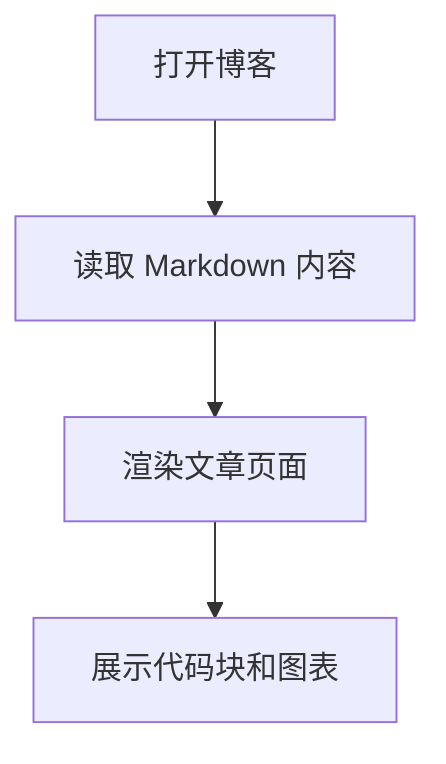
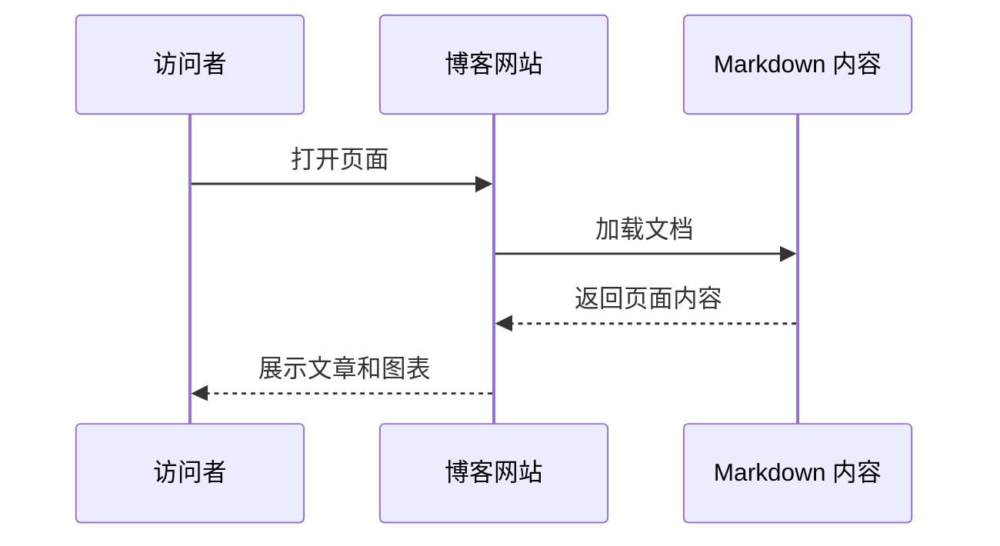
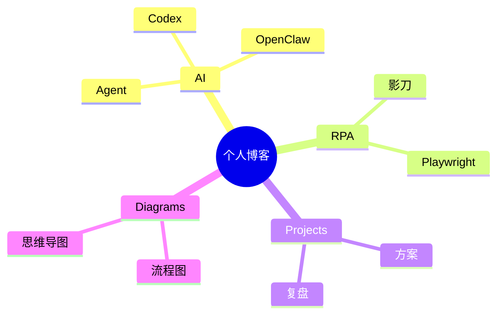

## Flowchart

```mermaid
flowchart TD
    A[打开博客] --> B[读取 Markdown 内容]
    B --> C[渲染文章页面]
    C --> D[展示代码块和图表]
```

## Sequence Diagram

```mermaid
sequenceDiagram
    participant User as 访问者
    participant Site as 博客网站
    participant Content as Markdown 内容

    User->>Site: 打开页面
    Site->>Content: 加载文档
    Content-->>Site: 返回页面内容
    Site-->>User: 展示文章和图表
```

## Mindmap

```mermaid
mindmap
  root((个人博客))
    AI
      Agent
      Codex
      OpenClaw
    RPA
      影刀
      Playwright
    Projects
      方案
      复盘
    Diagrams
      流程图
      思维导图
```
